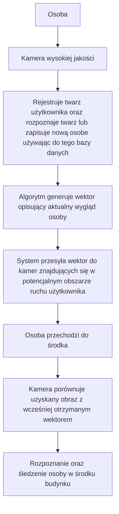

# BSc-Thesis - System Współpracujących Kamer
Ten projekt zakłada stworzenie systemu współpracujących kamer monitoringu, który umożliwia rozpoznawanie użytkowników na podstawie twarzy lub innych cech biometrycznych. Kluczowym elementem systemu jest przekazywanie informacji o wyglądzie osoby rozpoznanej w dobrze oświetlonym obszarze do kamer znajdujących się w mniej korzystnych warunkach (np. słabe oświetlenie, niższa jakość obrazu).

## Schemat budynku w celu lepszego zrozumienia celu projektu

## Kluczowe Funkcje

- **Rozpoznawanie twarzy**
  - Kamera o wysokiej jakości i dobrym oświetleniu przeprowadza identyfikację osoby i generuje jej wektor liczbowy opisujący wygląd.

- **Przekazywanie informacji**
  - System przesyła wygenerowany wektor do innych kamer w budynku.

- **Ulepszona identyfikacja**
  - Kamery o gorszej jakości wykorzystują otrzymany wektor do poprawy wyników rozpoznawania.

- **Mapowanie pola widzenia kamer**
  - Każda kamera posiada informację o swoim zakresie widzenia oraz o zakresach innych kamer.

- **Przewidywanie ruchu**
  - Gdy osoba zbliża się do granicy pola widzenia jednej kamery, informacja o jej wektorze przekazywana jest do kolejnej kamery lub kamer.

## Sposób Działania

## Przypadki Użycia

**1. Monitoring biur i budynków firmowych**

**2. Kontrola dostępu w budynkach o wielu punktach wejścia**

**3. Inteligentne systemy bezpieczeństwa**

## Potencjalne Problemy i Ich Rozwiązania

**1. Zakres Widzenia Kamer**

  - **Problem:** Skąd kamera ma wiedzieć, która inna kamera może przejąć obserwację osoby?

**3. Realistyczność Niskokosztowego Systemu**

  - **Problem:** Czy tanie kamery mogą dobrze rozpoznawać twarze na podstawie przesłanych danych oraz czy z darmowych narzędzi jesteśmy w stanie zrobić dobry system rozpoznawania osoby niezależnie od kamery?

**4. Czy Można To Zaimplementować w budynku B9?**

  - **Problem:** Gdzie przeprowadzić testy do takiego projektu?

**5. Czy system, który działałby niezależnie od budynku i liczby kamer jest możliwy do implementacji?**

  - **Problem:** Czy taki projekt nie byłby tylko i wyłącznie użyteczny dla jednego budynku? Czy istaniałyby sposoby do automatycznego mapowania kamer? Jeśli tak to, czy mamy do tego warunki aby przetestować to w innych budynkach?

**6. W jaki sposób kamery mające wspólne pole widoczności mają współpracować w celu rozpoznania osoby?**

  - **Problem:** Skąd wiemy, która kamera ma racje jeśli obie rozpoznają obiekt jako dwie inne osoby. Czy realne jest zaimplementowanie automatycznego algorytmu niezależnie od budynku w celu przydzielenia kamerom wag(ta która lepiej rozpoznaje lub ma lepsze oświetlenie itp. ma większą wagę)?
